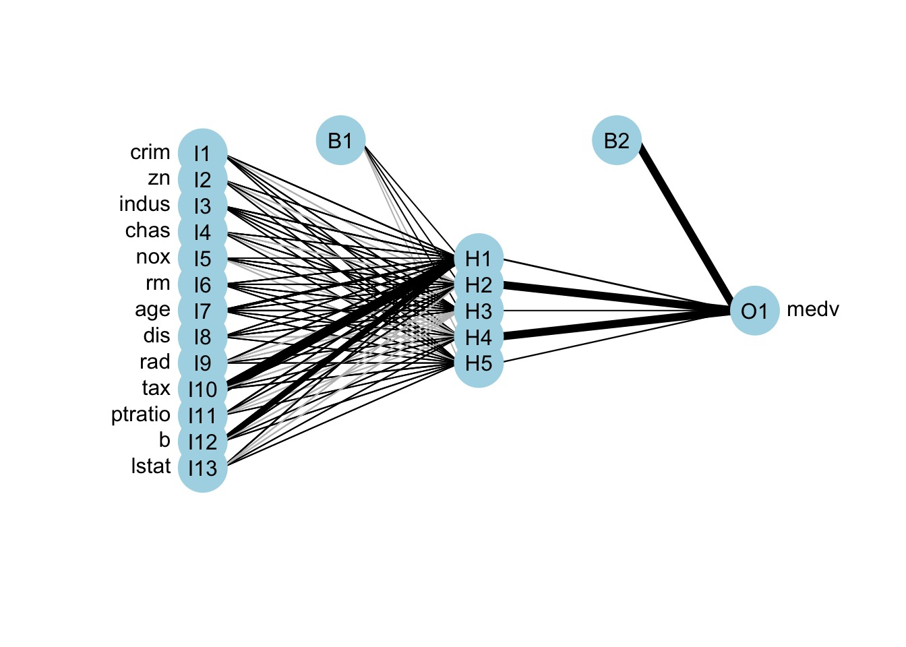
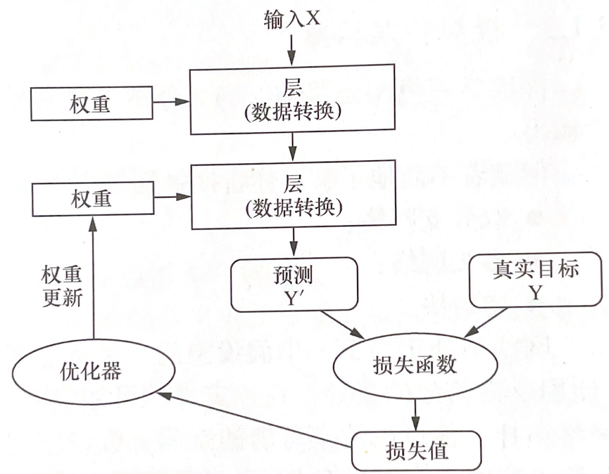
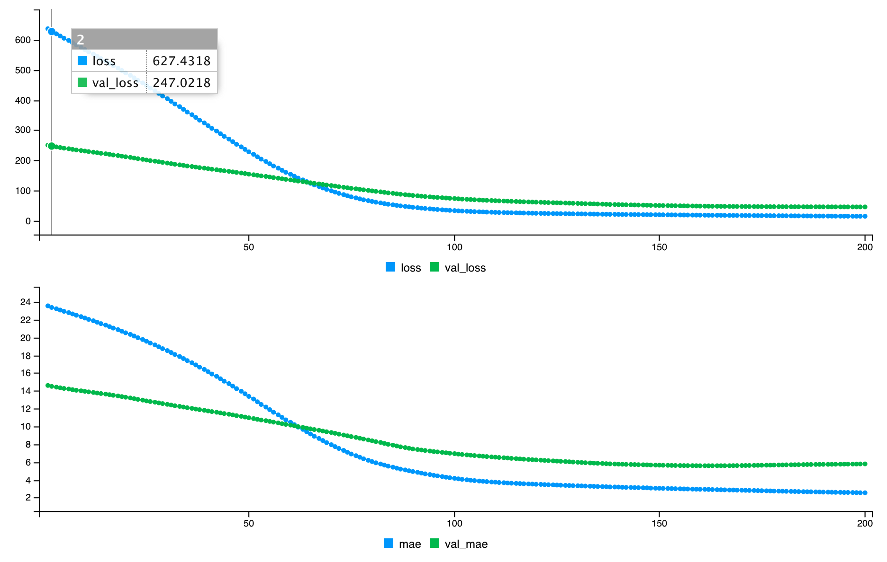
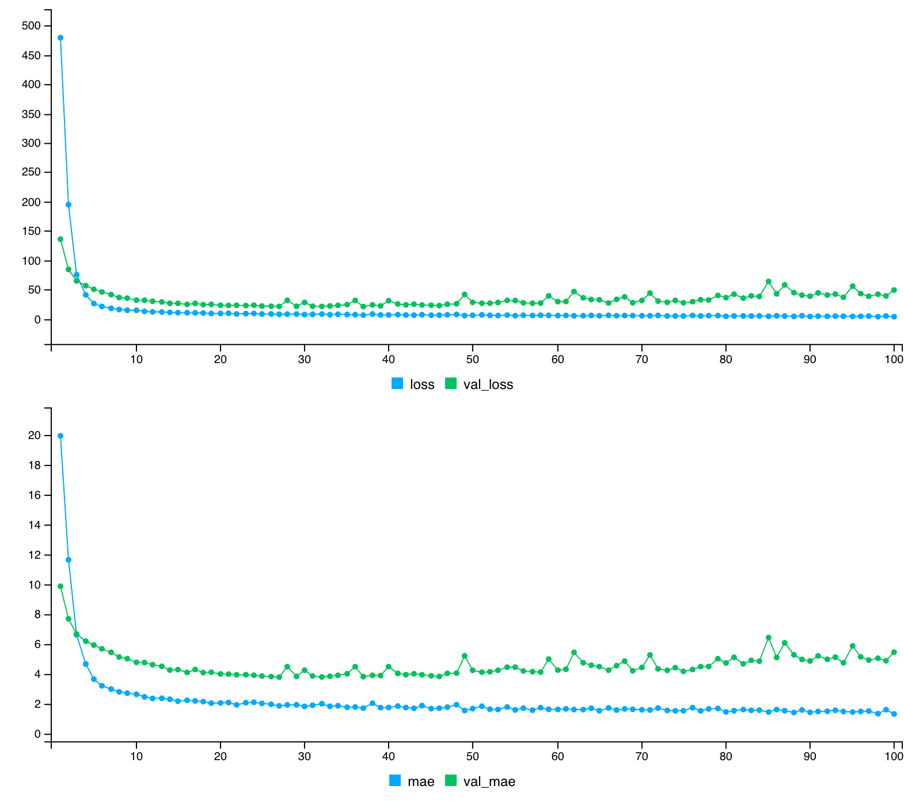
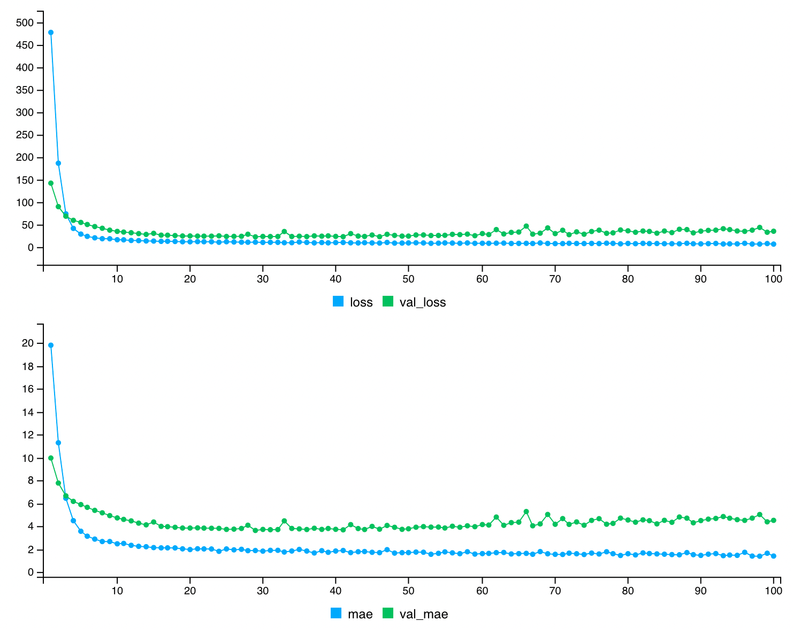
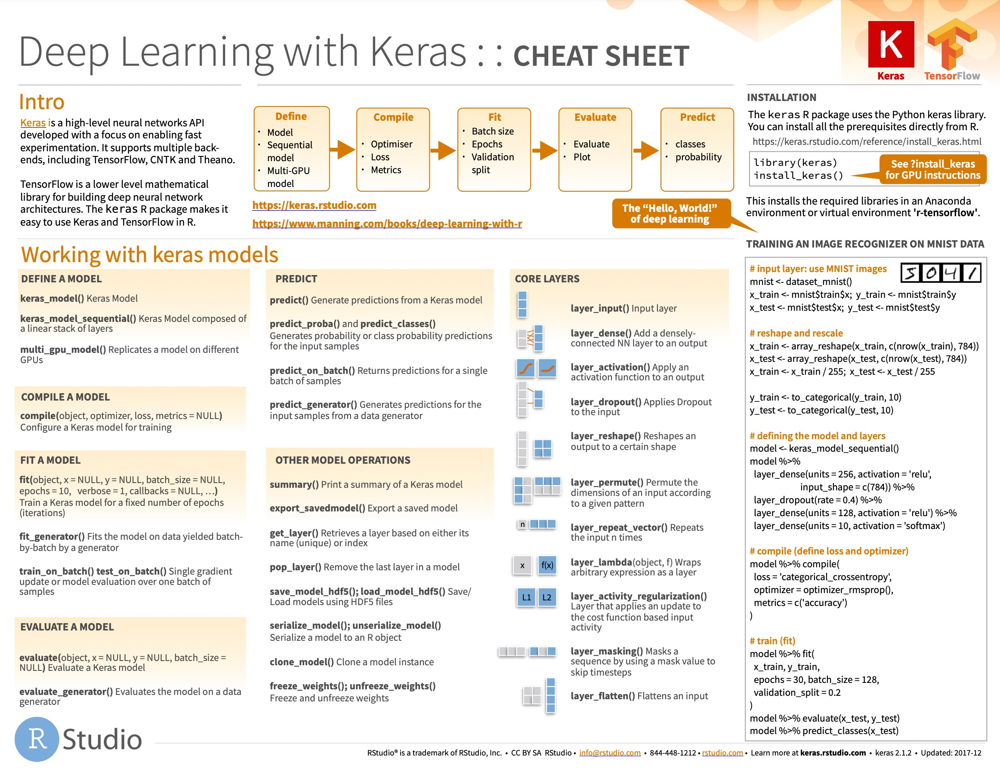
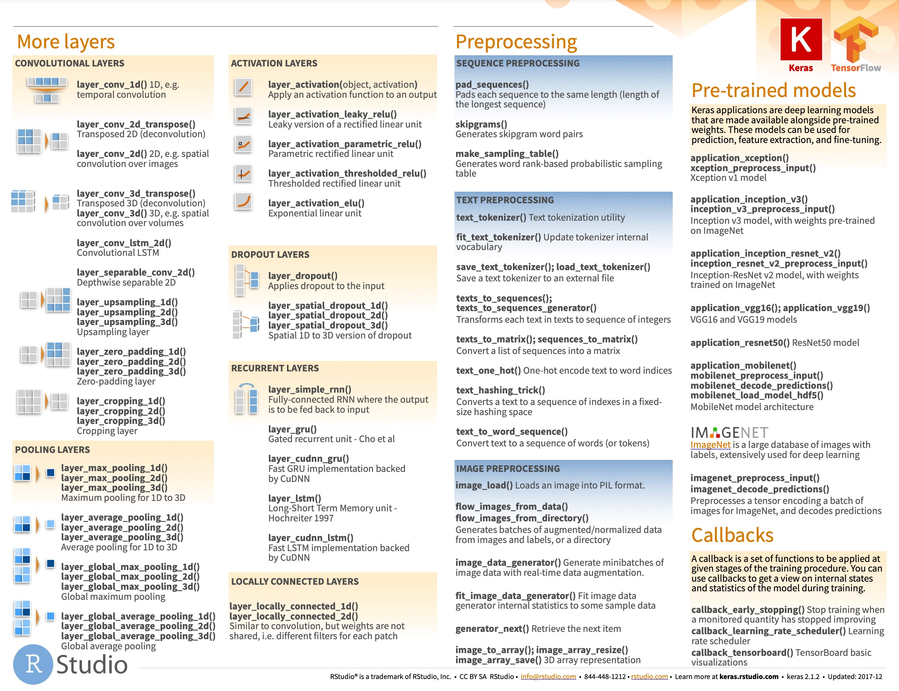

```{r setup, include=FALSE}
knitr::opts_chunk$set(echo = TRUE,warning = F,message = F)
```

## 简单神经网络建模

本节将从一个简单的[回归例子](https://github.com/fmmattioni/deep-learning-with-r-notebooks/blob/master/notebooks/3.6-predicting-house-prices.Rmd)来介绍如何在 R 中使用 keras 包进行深度学习。

> 如果你的设备有 GPU，并想用 GPU 训练模型。你不需要修改以下的代码，只需前期安装 GPU 版本的 TensorFlow，默认情况下，运算会优先使用 GPU。

知识点包括：

1.  数据导入与数据处理。

2.  构建神经网络。

3.  训练神经网络。

4.  评估模型的准确性。

5.  保存并恢复创建的模型。

### 加载包

```{r}
library(keras)
library(mlbench) #使用内部数据
library(dplyr)
library(magrittr)
```

### 加载数据

使用 1970 年波士顿 506 个人口普查区的住房数据作为例子。该数据集一共有14列，506 行。其中，因变量为 medv（自有住房的中位数报价, 单位 1000 美元），自变量为其他 13 个变量，包括：CRIM （城镇人均犯罪率）、ZN（占地面积超过 25000 平方英尺的住宅用地比例）、INDUS （每个城镇非零售业务的比例）等。

-   **形式一：**

```{r}
data("BostonHousing")
data <- BostonHousing 
data %<>% mutate_if(is.factor, as.numeric)
knitr::kable(head(data[,1:12])) 
```

-   **形式二**

keras 包内部已经整理好数据，只需使用适当代码即可得到数据集。

``` markdown
library(keras)
dataset <- dataset_boston_housing()
c(c(train_data, train_targets), c(test_data, test_targets)) %<-% dataset
str(train_data)
str(test_data)
str(train_targets) #价格主要在 10000～50000 美元之间
```

### 数据处理

#### 划分训练集与测试集

-   **形式一：**

首先，对 506 条数据进行划分。随机选择其中的 70% 数据作为训练样本，另外 30% 数据作为测试样本。

```{r}
# 构建矩阵
data <- as.matrix(data)
dimnames(data) <- NULL

# 数据集划分
set.seed(1234)
ind <- sample(2, nrow(data), replace = T, prob = c(.7, .3)) #从 1，2 中有放回抽取一个数，概率分别为（0.7，0.3）。
training <- data[ind==1,1:13]
test <- data[ind==2, 1:13]
trainingtarget <- data[ind==1, 14]
testtarget <- data[ind==2, 14]
```

-   **形式二：**

> 数据集 BostonHousing 也可以直接通过 keras 包中的 `dataset_boston_housing()` 进行加载，并且已经提前划分好了训练集和测试集。本文使用的是 mlbench 包中数据集进行加载，主要是呈现划分数据集的过程。

#### 标准化数据集

此外，由于各个特征的数据范围不同，直接输入到神经网络中，会让网络学习变得困难。所以在进行网络训练之前，先将该数据集进行特征标准化：输入数据中的每个特征，将其减去特征平均值并除以标准差，使得特征值以 0 为中心，且具有单位标准差。在 R 中可以使用 `scale()` 函数实现该效果。

```{r}
# 数据标准化
m <- colMeans(training)
s <- apply(training, 2, sd)
training <- scale(training, center = m, scale = s)
test <- scale(test, center = m, scale = s)
```

### 构建模型

由于可用样本量很少，这里构建一个非常小的网络。使用 `keras_model_sequential()` 定义模型，并设置了 1 个隐藏层。激活函数为 relu。



```{r}
keras_model_sequential() 
model <- keras_model_sequential() %>% 
         layer_dense(units = 10, activation = 'relu', input_shape = c(13)) %>%
         layer_dense(units = 1)
```

通过 `summary()` 查看模型个层形状和参数，可以看到，总共包含 151 个参数。

```{r}
summary(model)
```

### 编译模型

编译主要需要设定三个部分：

1.  损失函数：训练期间需要最小化的目标函数；
2.  优化器：对数据和损失函数进行自我更新；
3.  监控度量：训练和测试期间的评价标准。



该例子是一个典型的回归问题，我们使用的损失函数是均方误差（Mean Square Error，MSE），即预测和目标之间差异的平方。使用均方根传播方法（Root Mean Squared Propagation，RMSProp）作为该模型的优化器。使用 MSE 平均绝对误差（Mean Absolute Error，MAE）来监控网络。

```{r}
model %>% compile(loss = 'mse', #损失函数
                  optimizer = 'rmsprop', #优化器
                  metrics = 'mae'#监控度量
                  )
```

> 优化器有很多种，详细介绍可参考：[理论](http://www.cs.toronto.edu/~tijmen/csc321/slides/lecture_slides_lec6.pdf)、[实践](https://keras.io/api/optimizers/)；损失函数和评价度量的选择，可以参考这篇[博客](https://machinelearningmastery.com/how-to-choose-loss-functions-when-training-deep-learning-neural-networks/)。

### 拟合模型

拟合模型时，RStudio 的 Viewer 会出现：随着迭代变化的损失函数值。如下所示：

```{r}
mymodel <- model %>%
         fit(training,
             trainingtarget,
             epochs = 200,
             batch_size = 32,
             validation_split = 0.2)
```



图中的 loss 是指损失函数，val_loss 是指验证集下的损失函数（代码中设置的验证集划分比例为 0.2）。 mae 表示平均绝对误差，而 val_mae 表示验证集下的平均绝对误差。图中可以看到，随着训练轮数的增加，mae 与 loss 在不断减小并趋于稳定。

### 评估模型

使用 `evaluate()` 评估模型，给出预测结果。计算真实值和预测值的均方误差。

```{r}
model %>% evaluate(test, testtarget)
pred <- predict(model,test) #预测结果
mean((testtarget-pred)^2) #计算均方误差
```

通过 [ggplot2](https://ggplot2.tidyverse.org/) 包将预测结果和真实结果可视化。

```{r}
library(ggplot2)
library(ggsci)
ev_data = data.frame("Item" = seq(1,length(pred)),
                     "Value" = c(testtarget,pred),
                     "Class" = rep(c("True","Pred"),each = length(pred)))
ggplot(ev_data,aes(Item,Value,col = Class,lty = Class)) +
  geom_point() +
  geom_line() +
  scale_color_manual(values = c("#42A5F5","#66BB6A")) +
  theme_bw() + 
  theme(panel.grid = element_blank())
```

总体来看，预测结果还算不错，但是也有一些预测结果和真实值相差甚远。

### 存储/加载模型

三种形式可以选择：

1.  保存权重

使用 `save_model_weights_hdf5` 和 `load_model_weights_hdf5` 保存和加载模型权重。

    # save in SavedModel format
    model %>% save_model_weights_tf('my_model/')

    # Restore the model's state,
    # this requires a model with the same architecture.
    model %>% load_model_weights_tf('my_model/')

2.  保存配置

<!-- -->

    # Serialize a model to JSON format
    json_string <- model %>% model_to_json()

    fresh_model <- model_from_json(json_string,
                                   custom_objects = list('MyModel' = my_model_constructor))

3.  保存整个模型

使用 `save_model_tf()` 函数保存模型。

```{r}
save_model_tf(object = model, filepath = "BostonHousing_model") #保存模型
```

使用 `load_model_tf()` 函数加载模型，并对新数据集（下面使用测试集）进行预测。

```{r results='hide'}
reloaded_model <- load_model_tf("BostonHousing_model") #加载模型
pred3 <- predict(reloaded_model, test) #对新数据集进行预测
```

以上例子介绍了如何使用神经网络来处理简单问题（数据量较小的回归问题），但在实际过程中可能面临种种困难，包括：**如何对数据进行预处理**，**如何进行特征筛选**，**如何解决过拟合问题**，**如何调整参数**等。

## 相关拓展

### 调整参数

-   调整网络层数与神经元个数

```{r}
model2 <- keras_model_sequential() %>% 
    layer_dense(units = 64, activation = "relu", 
                input_shape = c(13)) %>% 
    layer_dense(units = 64, activation = "relu") %>% 
    layer_dense(units = 1) 

model2 %>% compile(
    optimizer = "rmsprop", 
    loss = "mse", 
    metrics = c("mae")
  )

mymodel2 <- model2 %>%
         fit(training,
             trainingtarget,
             epochs = 100,
             batch_size = 32,
             # verbose = 0, 
             validation_split = 0.2)
```

```{r}
model2 %>% evaluate(test, testtarget)
pred2 <- predict(model2,test) #预测结果
mean((testtarget-pred2)^2) 
```


```{r}
model3 <- keras_model_sequential() %>% 
    layer_dense(units = 256, activation = "relu", 
                input_shape = c(13)) %>% 
    layer_dense(units = 256, activation = "relu") %>% 
    layer_dense(units = 1) 

model3 %>% compile(
    optimizer = "rmsprop", 
    loss = "mse", 
    metrics = c("mae")
  )

mymodel3 <- model3 %>%
         fit(training,
             trainingtarget,
             epochs = 100,
             batch_size = 32,
             # verbose = 0, 
             validation_split = 0.2)
```



```{r}
model3 %>% evaluate(test, testtarget)
pred3 <- predict(model3,test) #预测结果
mean((testtarget-pred3)^2) 
```

### 过拟合问题

**概念**： 在测试集预测效果好，但在验证集表现效果不佳。过你和发生在每个机器学习问题中。

**解决方案**：

1.  获取更多训练数据

2.  缩小网络规模

> 减少可学习的参数（由层数、每层单元数决定）。

3.  添加权重正则化

通过强制权重仅采用较小的值来对网络的复杂性施加约束，并且通过项网络的损失函数添加与具有大权重相关联的成本来完成。

-   L1 正则化：增加的成本与权重系数的绝对值成比例；

-   L2 正则化：增加的成本与权重系数的值的二次方成比例；

**使用方法**：

在 `layer_dense()` 中添加 `kernel_regularizer =  regularizer_l2(0.01)`



4.  添加 dropout

应用于层的滤除包括在训练期间随机丢弃层的多个输出特征。例如:[0.2,0.5,1.3,0.8,1.2]，应用 dropout 后，向量将随机分布几个零条目，例如，变为：[0,0.5,1.3,0,1.2]。

**使用方法**：

通过 `layer_dropout()` 在网络中引入 dropout，应用于层后。设定值通常在 0.2 - 0.5 之间。

## 深度学习的通用工作流程

1.  定义问题并整合数据集

2.  选择衡量成功的标准

3.  确定评估方案

    -   留出法验证集
    -   K 折交叉验证
    -   重复 K 折交叉验证

4.  准备数据

    -   数据处理： 划分训练集，测试集；标准化数据集；缺失值处理；数据格式转化等

5.  开发模型

    -   最后一层激活。分类： `sigmoid` 函数；回归：不使用激活。
    -   损失函数：分类：`binary_crossentropy`; 回归：`mse`。
    -   优化配置：哪种优化器？学习率多少？默认使用 `rmsprop` 及默认学习率即可。

6.  开发一个过拟合模型

7.  正则化模型并调整超参数

## 相关教程

下面给出一些相关资源以供读者翻阅。

> 该系列还会继续写下去，欢迎来我的公众号《庄闪闪的 R 语言手册》关注新内容。

1.  RStudio 官网 TensorFlow [资料](https://tensorflow.rstudio.com/) 和 AI 相关 [博客](https://blogs.rstudio.com/ai/);

2.  书籍：[《Deep Learning with R》](https://www.manning.com/books/deep-learning-with-r)，对应 [代码](https://github.com/fmmattioni/deep-learning-with-r-notebooks)，[中文翻译版本](https://item.jd.com/13183476.html)。

3.  入门教程：[keras: R 语言中的深度学习](https://www.datacamp.com/community/tutorials/keras-r-deep-learning)；

4.  基于 Keras 和 TensorFlow 的深度学习的 [研讨会](https://github.com/rstudio-conf-2020/dl-keras-tf)；

5.  相关视频

    1.  [基于R语言的深度学习：针对入学者](https://www.youtube.com/watch?v=xzbVK2tqTfM&t=11978s)；
    2.  Shirin 在 2020 年 R 会议的报告：[《基于R语言的深度学习》](https://www.youtube.com/watch?v=uBISMeExoqk)，[会议笔记](https://gitlab.com/ShirinG/keras_tutorial_user2020)。

> 防止读者加载不了视频，作者已将其搬运到 B 站 [(1)](https://www.bilibili.com/video/BV1E3411n7Ry/)， [(2)](https://www.bilibili.com/video/BV1W34y1v795/?spm_id_from=333.788)，仅供大家学习使用。

6.  RStudio 官方给出的 Keras [速查表](https://raw.githubusercontent.com/rstudio/cheatsheets/main/keras.pdf)。





### 相关案例

-   [R 中使用 TensorFlow Probability](https://blogs.rstudio.com/ai/posts/2019-01-08-getting-started-with-tf-probability/)
-   [表示学习](https://blogs.rstudio.com/ai/posts/2018-10-22-mmd-vae/#our-objective-today)
-   [几何深度学习](https://blogs.rstudio.com/ai/posts/2021-08-26-geometric-deep-learning/)
-   [基于空间预测的卷积 LSTM 网络](https://blogs.rstudio.com/ai/posts/2020-12-17-torch-convlstm/)
